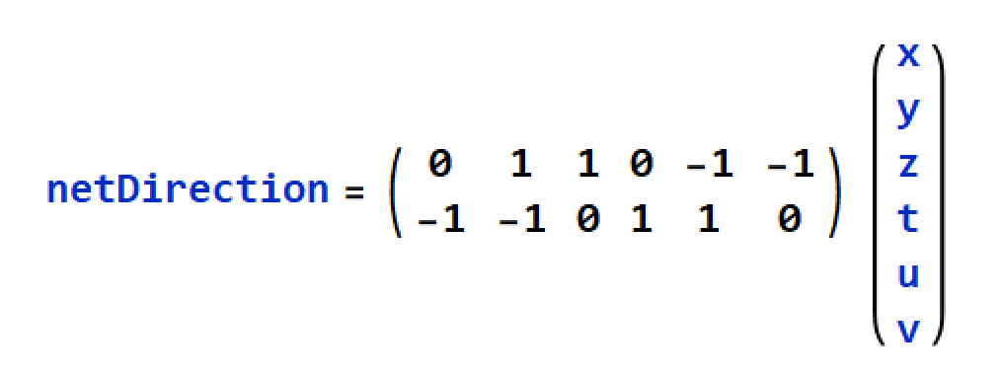

# ScatterLife
A universe simulation based on the principles of special relativity, mass, and energy.

------------

## Playing Field

Scatterlife takes place on a hexagonal lattice, wrapped at the edges like Asteroids. (flat torus topology.)

There are only 6 flavors of particles, a distinct one for each direction.

Each particle travels at 1 cell per timestep in its respective direction.

## Interactions

Interactions can happen when two or more particles will enter the same cell.

***Conservation Laws***
* **Particle Count**: the initial number of particles handled by an interaction is preserved
* **Net Direction**: the net direction/momentum of the particles interacting is preserved.

Each particle's direction can be looked at as a 2-vector.

The directionality of N particles is simply the sum of their respective vectors.
Given the particle counts = <x,y,z,t,u,v>, we can calculate the net direction by matrix multiplication.

## Scattering function
The scattering function is applied to every cell at every new timestep after uptaking incoming particles from neighboring cells.

f(<x,y,z,u,t,v>): ℕ_6 -> ℕ_6 

This function has a few important properties dictated by the conservation laws.
Σx = Σf(x) (particle counts conserved)
netDirection(x) = netDirection(f(x)) (corresponding to the matrix/vector multiplication above)

## Special relativity
Energy is manifested in this simulation as magnitude of change per unit time.
All 6 particles have equivalent energy.

To meet the criteria of special relativity, change and movement are orthogonal.
That is, any particle that transformed by scattering becomes immobile for a single time step.

In the code this is termed as 'bound.'

Thus each cell has a 6-vector for unbound particle counts, and another 6-vector for bound particle counts.
